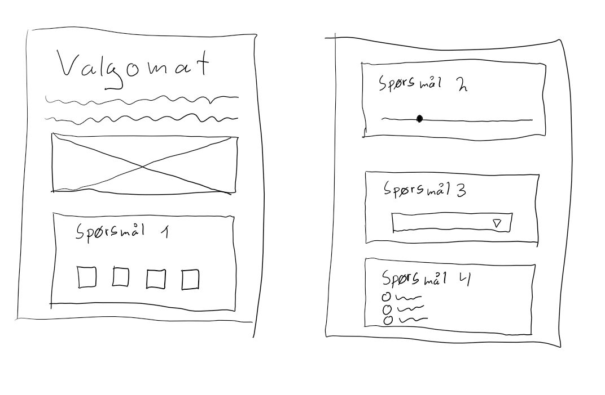

# Valgomat

Beskrivelse av appen:

Denne appen er en valgomat app som beregner ut hvilket politisk parti du har flest like meninger med. Etter å ha svart på alle spørsmålene og trykket på vis resultater vil du få vite hvilke 3 partier som du har flest like meninger som og du vil dermed få et innblikk i hvilke partier du kan og bør stemme på.

## Wireframes

viser wireframes som illustrerer layout

## Design

Jeg har valgt å dele opp spørsmålene i ulike div bokser og stylet disse til jeg synes de ble fine. Jeg har også designet bakgrunnen slik at den gjør nettsiden finere å se på.

## TODO
  - gjøre ferdig wireframes
  - lage spørsmål til valgomaten
  - putte inn spørsmålene i svelte ved bruk av input
  - lage en algoritme som behandler inputtet fra brukeren
  - gjøre nettsiden fin ved bruk av css

## Known bugs
  
Dersom du endrer svar på noen av input feltene vil det første svaret også gi poeng. Dermed kan resultatet bli litt feil om man endrer mye på svarene.